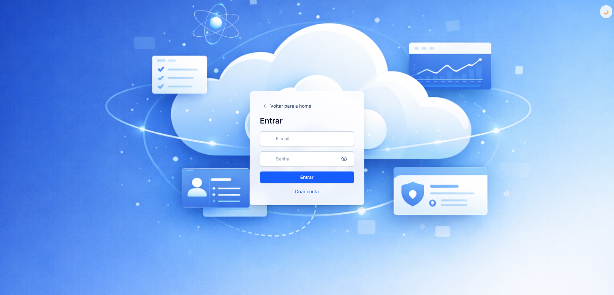
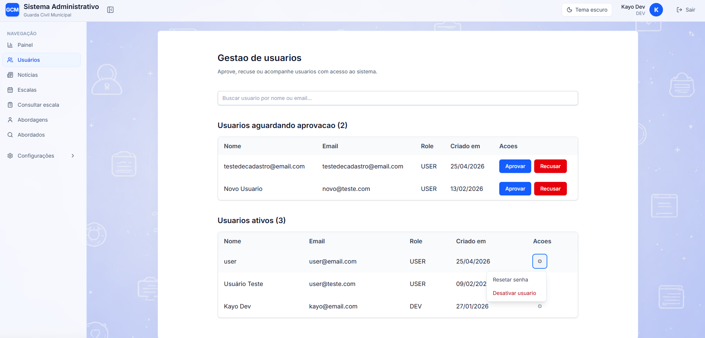
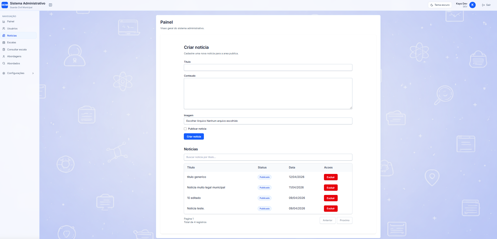
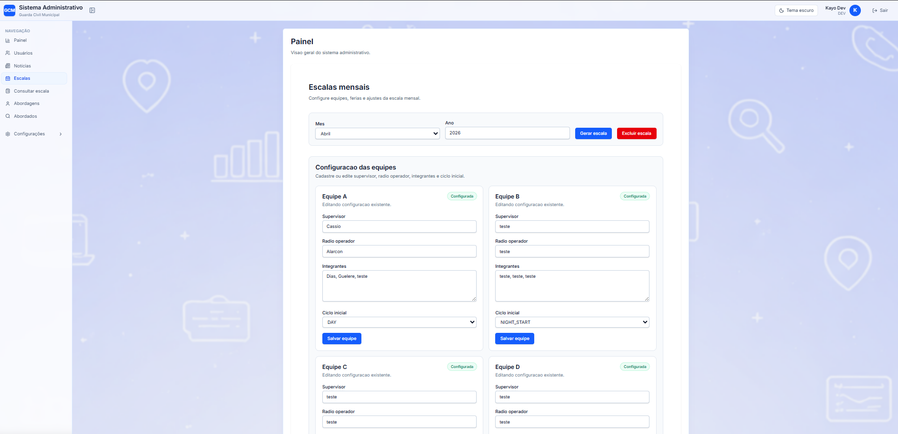
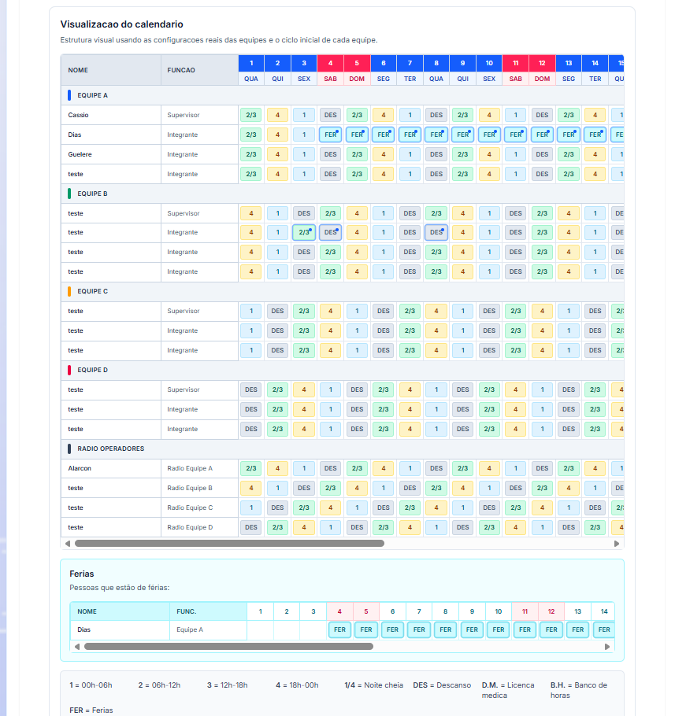
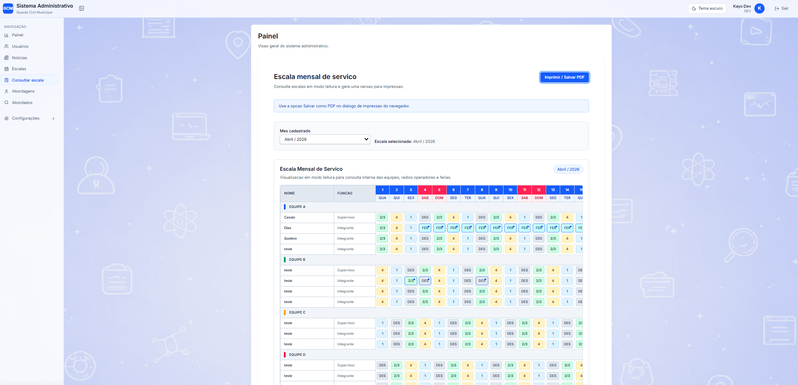
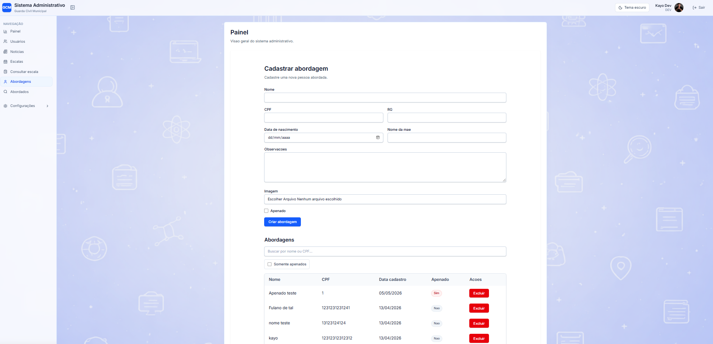
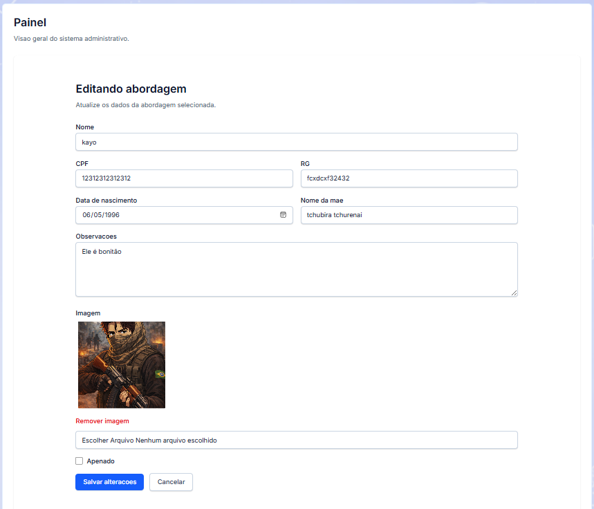
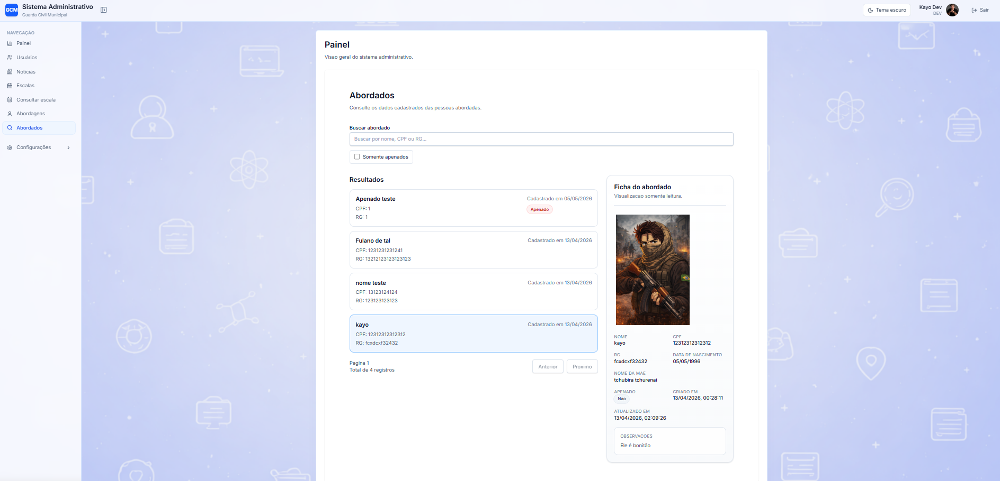

# CMS Administrativo GCM

A fullstack administrative management system inspired by real operational workflows, built as a production-oriented technical challenge.

# CMS Administrativo GCM

A fullstack administrative management system inspired by real operational workflows, built as a production-oriented technical challenge.

## Overview

**CMS Administrativo GCM** is a fullstack web application designed to manage internal administrative routines through a secure, role-based system.

The project was developed as a real-world technical challenge with focus on:

- authenticated access and session handling
- role-based permissions
- internal news management
- approach/record management
- monthly scale management
- PDF/print-ready scale visualization
- production deployment and environment configuration
- security hardening and automated backend testing

Although inspired by a real operational context, the system is presented as a **general administrative platform**, making it more flexible and relevant as a portfolio project.

## Project Goal

The goal of this project was to build a system that goes beyond a simple CRUD application and demonstrates real-world software engineering concerns, such as:

- authentication and authorization
- sensitive data protection
- production deployment
- environment management
- API and frontend integration
- printing/export workflows
- UI consistency
- maintainable architecture
- test coverage for critical flows

This project represents my **first real technical challenge brought to production**, covering both development and deployment decisions from backend to frontend.

## Key Highlights

- Fullstack application with separate frontend and backend
- Role-based access control with multiple user profiles
- Production deployment with frontend and backend hosted independently
- Backend tests for critical authorization and security flows
- Print-oriented scale visualization with dedicated PDF/print view
- Security improvements around authentication, permissions, rate limiting and protected resources
- Administrative UX improvements and visual consistency across the system

## Authentication & Access Control

Authentication and access control were designed as core parts of the system, not as an afterthought.

The application includes a complete login and account lifecycle flow with production-oriented behavior, covering:

- user registration
- login with protected routes
- session persistence
- automatic logout after inactivity
- invalid session handling
- controlled administrative approval flow
- email verification structure
- role-based authorization across frontend and backend

### Authentication Features

- **User registration flow**
  - new users can create an account through the public registration page
  - newly created accounts are not immediately treated as fully active administrative users
  - account lifecycle includes verification and approval-related states

- **Login flow**
  - users authenticate through the frontend login page
  - protected areas are only available after successful authentication
  - invalid credentials return appropriate feedback to the user

- **Session handling**
  - authentication state is persisted on the client
  - session restoration is validated on application startup
  - invalid or expired sessions are automatically cleared

- **Automatic logout by inactivity**
  - sessions are automatically terminated after a period of inactivity
  - this improves security for internal administrative usage
  - the user is redirected back to login with a contextual message

- **Global invalid session handling**
  - unauthorized backend responses trigger automatic session cleanup
  - this prevents the frontend from staying in a false “logged-in” state
  - especially useful after backend restart, invalid token, or expired session

- **Password visibility and login UX improvements**
  - the login form includes password visibility controls
  - authentication feedback was visually improved with reusable alert-style components
  - navigation flow was refined with a “return to home” action

### Roles and Authorization Model

The system uses a multi-role access model:

- **USER**
  - limited internal access
  - can view allowed operational data
  - cannot access administrative editing areas

- **SUPERVISOR**
  - elevated operational permissions compared to regular users
  - still restricted from full system administration

- **ADMIN**
  - full administrative access over platform management features

- **DEV**
  - full administrative access, equivalent to or broader than ADMIN
  - intended for technical/maintenance-level control of the system

Authorization is enforced in two layers:

- **frontend**
  - route protection
  - conditional rendering of menus and administrative sections

- **backend**
  - protected endpoints with authentication middleware
  - role checks for sensitive operations

This dual-layer approach ensures that permissions are not enforced only by UI visibility, but also by the API itself.

### Security-Oriented Authentication Improvements

During development, the authentication layer was hardened with production-focused adjustments such as:

- login rate limiting
- session invalidation handling
- environment validation for critical secrets
- controlled bootstrap flow for the first DEV user
- controlled password reset script for administrative recovery
- backend test coverage for critical authentication and authorization scenarios

These decisions helped transform the project from a basic internal app into a more realistic production-oriented administrative system.

### Authentication Screens

**Login**

**Registration**

## User Management

User management is one of the central administrative modules of the system.

It was designed to support controlled internal access, account lifecycle monitoring, and administrative decision-making over who can access protected areas of the platform.

### Main Capabilities

- **User listing**
  - administrators can view registered users in a dedicated management area
  - the module presents account information in a structured and searchable way

- **Approval and rejection workflow**
  - newly registered accounts are not treated as fully active administrative users by default
  - administrative roles can review pending users and decide whether to approve or reject access
  - this creates a controlled onboarding process for internal usage

- **Role-based user control**
  - the system supports multiple roles such as `USER`, `SUPERVISOR`, `ADMIN`, and `DEV`
  - administrative actions are restricted according to backend and frontend authorization rules
  - `DEV` is treated as a full administrative role for technical control of the system

- **Status handling**
  - user accounts include lifecycle-related states such as approval and verification conditions
  - this makes the module more realistic than a simple “registered / not registered” flow

- **Profile-related information**
  - user records support additional profile fields beyond just email and password
  - this helps the system behave more like a real administrative platform rather than a minimal auth demo

### Administrative Control

The user management flow was built with the idea that account access should be reviewed and controlled, especially in systems that manage internal or sensitive operational data.

This means the module is not limited to CRUD behavior. It also reflects administrative concerns such as:

- who is allowed to enter the system
- whether the account has already been verified
- whether the user has been approved for internal access
- which role that account should hold inside the platform

### Security and Control Highlights

- protected user endpoints on the backend
- role-based access checks for administrative actions
- approval and rejection flows restricted to elevated roles
- frontend route and menu protection for user management screens
- controlled bootstrap flow for first technical administrative access
- password recovery support through controlled administrative scripts during deployment/maintenance stages

### Why This Module Matters

This module helped move the project beyond the level of a simple authentication demo.

It introduced a more realistic internal administration layer, where access is intentionally reviewed and controlled, reflecting concerns that are common in real production systems with restricted user entry and role-sensitive operations.

### User Management Screen

## News Management

The project includes an internal news management module designed to support administrative publishing workflows.

This module allows authorized users to create, edit, organize, and publish informational content inside the system, making the platform more complete than a purely operational dashboard.

### Main Capabilities

- **News listing**
  - news entries can be viewed in an organized administrative list
  - the module supports structured content management rather than static hardcoded information

- **Create and edit news**
  - authorized administrative users can create new news posts
  - existing posts can be edited when updates are needed
  - this allows the system to behave more like a real CMS-style administrative platform

- **Controlled publishing flow**
  - news management is restricted by role
  - only elevated administrative roles can access editing and management actions
  - this prevents unauthorized users from modifying public-facing or internal informational content

- **Image support**
  - news entries support image upload/association
  - upload validation was treated as part of the production-oriented hardening process

- **Public and administrative separation**
  - the project distinguishes between the public-facing consumption of news content and the administrative tools used to manage it
  - this separation helps simulate a more realistic production structure

### Administrative Control and Security

The news module is protected both in the frontend and backend.

This includes:

- protected administrative routes
- role-based access to create, update, and delete content
- upload restrictions for news images
- validation of request flow and permissions
- backend test coverage for administrative authorization rules

This makes the module more representative of a real content management workflow instead of a simple local-only CRUD example.

### Why This Module Matters

The news module adds an important product-oriented layer to the project.

It demonstrates that the system is not limited to internal records and operational controls, but also supports controlled content publishing, which is a common requirement in real administrative platforms.

This helped position the project as something closer to a practical administrative CMS rather than only a management panel.

### News Management Screen

## Scale Management

One of the most distinctive modules of the project is the monthly scale management system.

This module was designed to support the configuration, visualization, adjustment, and printing of structured monthly operational schedules, making it one of the most technically rich parts of the application.

### Main Capabilities

- **Monthly scale creation**
  - administrative users can create monthly scale structures based on month and year
  - each scale works as an organized scheduling unit with its own configuration and overrides

- **Team configuration**
  - the system allows administrators to define team composition for each monthly scale
  - teams can include roles such as supervisor, radio operator, and members
  - team structure is configured in a way that supports recurring operational cycles

- **Cell override system**
  - beyond the default cycle logic, the system supports direct override of individual cells
  - this allows administrators to adjust the schedule for specific people and dates
  - overrides make it possible to represent real operational exceptions such as:
    - vacations
    - shifts
    - day-specific changes
    - custom assignments

- **Scale visualization**
  - the application includes a dedicated visual calendar/grid view for monthly scales
  - the information is organized by team, role, and day of the month
  - the interface was refined to improve readability in both desktop and mobile contexts

- **Role-based access**
  - administrative roles can create and edit scales
  - restricted roles can access only the allowed read/view features
  - this preserves administrative control while still supporting operational consultation

### Print and PDF-Oriented Features

A major part of the scale module was the ability to generate a print-friendly view.

To support this, the project includes:

- **dedicated scale visualization for printing**
  - the print flow no longer depends only on the normal UI table
  - a dedicated print view was created to better fit A4 landscape output

- **PDF/print optimization**
  - print layout was refined to improve:
    - spacing
    - readability
    - compactness
    - column distribution
    - use of page area

- **vacation section support**
  - the scale includes a dedicated vacations section integrated with the override logic
  - this helps reflect more realistic scheduling adjustments in both visualization and print output

### Technical Highlights

This module required a combination of:

- frontend layout control
- backend structure for monthly scale persistence
- support for team configuration per scale
- override storage by person/date
- route protection and role checks
- print-oriented rendering strategy
- responsive handling for smaller screens

Because of that, the scale module became one of the strongest parts of the project from a technical portfolio perspective.

### Why This Module Matters

The scale system helped move the project beyond common administrative CRUD patterns.

It demonstrates the ability to model and implement a more domain-oriented feature with:

- structured monthly planning
- exception handling
- print/export concerns
- responsive UI challenges
- role-sensitive access control

This makes the project more representative of real-world administrative software, where scheduling, operational visibility, and printable outputs are often critical requirements.

### Scale Management Screens

## Approaches Module

The project includes a dedicated module for registering, managing, and consulting approached individuals.

This module was designed to handle structured records with controlled administrative access, making it one of the most sensitive and operationally relevant areas of the system.

### Main Capabilities

- **Approach registration**
  - authorized users can create new records through a dedicated form
  - the registration flow includes structured fields such as:
    - name
    - CPF
    - RG
    - birth date
    - mother's name
    - notes
    - image/photo
    - convicted status flag

- **Record editing**
  - authorized administrative roles can update existing records
  - editing supports both field correction and image replacement/removal
  - this allows the system to behave more like a real operational registry rather than a static data table

- **Approached records listing**
  - the system includes a dedicated consultation interface for previously registered individuals
  - records can be searched and filtered for quick operational lookup
  - the module supports a "convicted only" filter for focused consultation

- **Detailed visual record view**
  - selected records can be viewed in a detailed side panel / read-only profile view
  - this improves usability by separating operational lookup from editing actions

- **Convicted status support**
  - records may be explicitly flagged as convicted
  - both creation/editing and listing flows support this field
  - filtering by convicted status improves practical search and review workflows

### Access Control and Administrative Rules

This module is role-sensitive and was designed around controlled access.

The implemented behavior distinguishes between actions such as:

- creating records
- viewing records
- editing records
- deleting records

This makes the module more representative of a real internal administrative system, where operational access and administrative authority are not identical.

### Images and Sensitive Data Considerations

The approaches module also includes support for associated images.

Because the module deals with structured personal records, this part of the project received extra attention in areas such as:

- route protection
- upload validation
- file type restrictions
- file size limits
- protected resource access patterns
- review of public/static exposure risks

This made the module especially important from a security and architecture perspective.

### Why This Module Matters

The approaches module helped move the project closer to a realistic administrative platform.

Instead of being limited to generic CRUD data, it introduced a more sensitive operational workflow involving:

- structured personal records
- image association
- controlled editing
- differentiated permissions
- consultation-oriented UI
- production-oriented validation and hardening

From a portfolio perspective, this module is valuable because it demonstrates the ability to build around data sensitivity, administrative control, and practical operational usage patterns.

### Approaches Module Screens

**Create and manage approaches**

**Edit approach record**

**Approached records consultation**

## Security & Validation

Security and validation were treated as practical engineering concerns throughout the project, especially because the system handles authenticated access, role-sensitive actions, structured personal records, and internal administrative workflows.

Instead of relying only on frontend restrictions, the project applies protection in multiple layers, combining backend authorization, request validation, session handling, and safer production-oriented defaults.

### Authentication and Session Security

The authentication layer was reinforced with behaviors expected in a production-oriented administrative system, including:

- protected routes on both frontend and backend
- session restoration validation on application startup
- automatic cleanup of invalid sessions
- automatic logout after inactivity
- login rate limiting
- controlled bootstrap flow for the first DEV user
- controlled password reset script for administrative recovery

These decisions help reduce the risk of false authenticated states, stale sessions, and unrestricted initial administrative access.

### Role-Based Authorization

Authorization is not enforced only by hiding interface elements.

The system applies role validation in both layers:

- **frontend**
  - route protection
  - conditional rendering of navigation items and actions

- **backend**
  - authentication middleware
  - role-based guards for sensitive endpoints
  - explicit control over administrative actions such as:
    - user approval/rejection
    - news management
    - scale management
    - record editing/deletion

This dual-layer approach prevents the interface from being the only security boundary.

### Request Validation and Payload Limits

The backend was hardened with validation and request size restrictions to reduce abuse and prevent excessively large payloads.

Examples of this include:

- field length limits for multiple forms
- validation of structured administrative inputs
- protection against oversized JSON payloads
- controlled upload limits for images and files

This helps the application behave more predictably under real usage and reduces exposure to trivial abuse patterns.

### Upload and File Protection

Uploads received special attention because the project includes associated images for sensitive administrative records.

The system includes measures such as:

- MIME type restrictions
- file size limits
- protected access patterns for sensitive image routes
- path traversal protection
- review of public static exposure risks

This made file handling part of the security design, not just an auxiliary feature.

### Environment and Production Safety

The project also includes production-oriented safeguards around configuration and deployment, such as:

- validation of required environment variables at startup
- separation of production configuration concerns
- controlled handling of secrets like database connection and JWT secret
- deployment adjustments for proxy environments
- health check route for operational verification

This improved reliability during deployment and helped surface configuration mistakes early instead of failing silently.

### Testing of Critical Security Flows

To reduce regression risk, automated backend tests were added around critical flows, including:

- authentication
- invalid login handling
- protected route access
- role-based authorization
- upload restrictions
- pagination behavior
- scale permissions
- protected image/resource access

Although the first testing phase used Prisma mocking instead of a real database, it still provided strong coverage for critical route behavior and authorization rules.

### Why This Section Matters

Security in this project was not treated as a checklist item added at the end.

It was gradually reinforced as the system evolved, especially once the project moved toward real deployment and more realistic internal administrative use cases.

From a portfolio perspective, this shows the ability to think beyond feature delivery and consider:

- who should access what
- how requests should be validated
- how sensitive resources should be protected
- how production environments behave differently from local development

## Testing Strategy

Testing was introduced to protect the most critical parts of the system as the project evolved toward a production-ready portfolio case.

The goal was not to create exhaustive academic coverage, but to build a practical safety net around the flows most likely to break or cause security and authorization issues.

### Testing Stack

The backend test layer was built with:

- **Vitest** for the test runner and assertions
- **Supertest** for HTTP endpoint testing
- **Prisma mocking** for fast and isolated backend route validation

This approach allowed critical route behavior to be tested without depending on a real database in the first phase.

### What Was Covered

Automated backend tests were added for the most important operational and security-sensitive areas of the application.

Coverage includes:

- **authentication**
  - valid login
  - invalid login
  - unauthorized access to protected routes
  - login rate limiting behavior

- **role-based authorization**
  - permissions for `USER`, `SUPERVISOR`, `ADMIN`, and `DEV`
  - access control across administrative routes
  - protection of editing and deletion flows

- **news administration**
  - administrative route restrictions
  - content management authorization behavior

- **approaches module**
  - create/edit/delete authorization rules
  - operational access control
  - protected image/resource access behavior

- **uploads**
  - file type validation
  - file size limits
  - authenticated upload requirements
  - route-level permission enforcement

- **pagination**
  - default page and limit behavior
  - clamping of excessive limits
  - consistent response envelope validation

- **scale management**
  - role restrictions for reading versus editing
  - access to scale months, teams, and overrides
  - permission boundaries between operational consultation and administrative control

### Security-Oriented Test Value

A large part of the test suite was focused on the question:

> “Who is allowed to do what?”

This made the tests especially valuable for:

- preventing authorization regressions
- validating route protection
- reinforcing backend security expectations
- checking that frontend-visible permissions were also backed by API-level restrictions

In this sense, testing was strongly tied to the project’s administrative and security model, not just to generic CRUD behavior.

### Known Scope of the Current Test Phase

The initial test strategy intentionally focused on:

- backend route behavior
- authorization logic
- validation rules
- response contracts

Instead of:
- full end-to-end browser automation
- real database integration in every test
- visual/UI snapshot testing

This was a deliberate trade-off to keep the test suite fast, maintainable, and effective for the project stage.

### Why This Testing Approach Matters

For this project, testing was not added only as a portfolio keyword.

It was used as a practical tool to protect the most sensitive parts of the system while moving into a real deployment scenario.

From a portfolio perspective, this demonstrates an engineering mindset focused on:

- critical flow protection
- regression prevention
- secure route behavior
- pragmatic testing scope
- balancing coverage with maintainability

## Deployment & Production Readiness

A major milestone of this project was taking it beyond local development and making it run in a real hosted environment.

This project was deployed as a production-oriented portfolio case, which required solving practical issues related to environment configuration, backend hosting, database connectivity, frontend integration, proxy behavior, and real-world debugging.

### Deployment Architecture

The application was structured as a monorepo with separated frontend and backend services:

- **frontend**
  - built with React, TypeScript, Vite, and Tailwind CSS
  - deployed independently on **Vercel**

- **backend**
  - built with Node.js, Express, TypeScript, and Prisma
  - deployed independently on **Railway**

- **database**
  - PostgreSQL hosted on **Railway**

This setup allowed the project to behave like a more realistic fullstack application, with independently deployable services communicating through configured environment variables.

### Production Environment Configuration

To support deployment safely, the backend was prepared with explicit runtime validation for critical environment variables such as:

- `DATABASE_URL`
- `JWT_SECRET`
- `CORS_ORIGIN`
- `API_PUBLIC_URL`

This prevented silent startup failures and made deployment issues easier to identify.

On the frontend side, production setup depended on a correctly defined:

- `VITE_API_URL`

This separation between local and hosted environments became a central part of the production-readiness process.

### Key Deployment Adjustments

During deployment, several practical issues had to be solved to make the system work correctly in a hosted environment.

Examples include:

- backend startup configuration for Railway
- explicit server binding to `0.0.0.0`
- correct handling of `process.env.PORT`
- public domain generation and usage for the backend
- CORS alignment between Vercel frontend and Railway backend
- distinction between internal and public PostgreSQL connection URLs
- production migration execution against the hosted database
- controlled creation of the first DEV user in production

These were not theoretical concerns. They were resolved as part of getting the application online in a real environment.

### Proxy and Infrastructure Awareness

Once deployed, the backend also needed adjustments to behave correctly behind Railway’s proxy layer.

This included:

- configuring Express to trust the proxy
- preventing rate-limit errors caused by forwarded headers
- validating public route behavior after deployment
- confirming proper backend reachability through health checks

This was an important step in moving from “code that works locally” to “code that behaves correctly in production infrastructure.”

### Production Validation Flow

The deployment process included practical validation steps such as:

- testing the backend health endpoint
- applying Prisma migrations to the production database
- validating login in the published environment
- verifying frontend-backend communication
- reviewing environment-dependent failures through platform logs
- confirming administrative access with a real production DEV account

This turned deployment into a real engineering stage rather than a final push-button action.

### Why This Section Matters

This project represents my first real technical challenge taken into production.

Because of that, deployment was not just a hosting step. It became part of the learning and engineering value of the project itself.

From a portfolio perspective, this section demonstrates experience with:

- deploying a fullstack monorepo as separate services
- configuring production environments
- solving real platform-specific issues
- handling database migrations in hosted infrastructure
- debugging integration problems between frontend, backend, and database
- adapting the application to proxy-based hosting environments